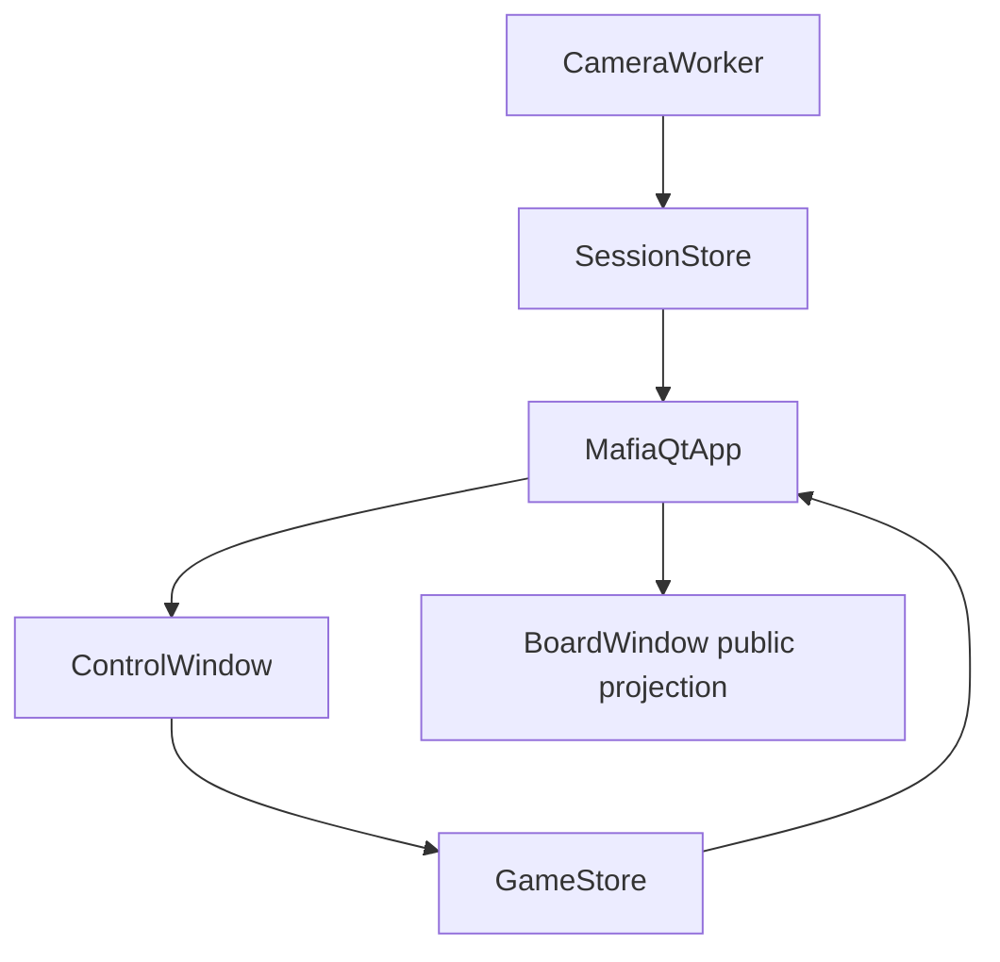

# Project Context

## Purpose

Automatic Mafia registers participants from a local camera, keeps stable player numbers and face identities, and provides a manual mafia game host flow with a separate public board.

## Stack

- UI: PySide6, two windows in one Qt process.
- Vision: OpenCV capture, `face_recognition`/dlib worker processes, position-based track holding.
- State: `SessionStore` for participants and `GameStore` for roles, phases and night actions.
- Data: local `data/known_faces.pkl`, `data/players/`, `data/mafia_session.json`, `data/mafia_game.json`.

## Commands

- Install: `source venv/bin/activate && venv/bin/pip install -r requirements.txt`
- Run: `source venv/bin/activate && python app.py`
- Compile check: `venv/bin/python -m compileall -q automatic_mafia app.py`

## Main Flow

## Important Paths

- `app.py`: Qt entry point.
- `automatic_mafia/ui/qt_app.py`: control window, public board, shared controller and public-data filtering.
- `automatic_mafia/vision/worker.py`: camera and face registration/tracking; must not write game actions.
- `automatic_mafia/storage/game_store.py`: only source of truth for roles, phases and night rules.
- `automatic_mafia/storage/session_store.py`: participant photos, stable numbers and elimination reasons.
- `automatic_mafia/storage/face_store.py`: persistent face database and encodings.
- `experiments/`: isolated camera/gesture/table evaluation stands; these do not import or write the main game state.

## Architecture Notes

- The host window may show service data; the board receives `MafiaQtApp.public_view()` only.
- Closing the board hides it without stopping the party. Closing the host stops camera resources and exits.
- Face visibility is not game status. Camera updates must never eliminate or restore players.
- Existing Tk UI remains in `automatic_mafia/ui/app.py` as legacy code, but `app.py` no longer starts it.
- Experiments exchange only `experiments/person_face/results/participants.json` using schema `automatic-mafia.experiments.participants/v1`; the main session store is not part of this flow.

## Current Risks

- Physical X11 visual verification depends on the machine's Qt/xcb libraries; offscreen smoke testing is available.
- The public board currently uses the host's public phase projection and does not yet have a configurable speaking timer.
